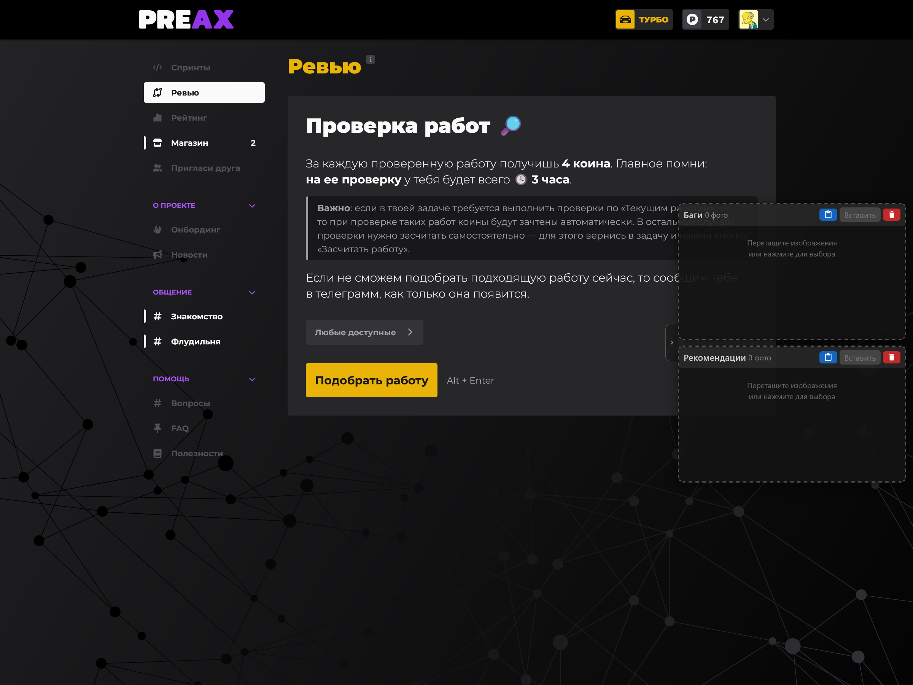

# Preax Image Pool — Tampermonkey userscript

Userscript для сайта [preax.ru](https://preax.ru), добавляющий два фиксированных пула изображений для быстрой вставки в Lexical-редактор на страницах заполнения отзывов.

---

## Возможности

- **2 независимых пула** изображений для страниц «Баги» и «Рекомендации», закреплённых у правого края экрана
- **Автоматическая вставка** изображений и пулов в поля ввода при переходе на соответствующий шаг отзыва
- **Зелёная рамка** на активном пуле индицирует совпадение пула с шагом ревью шага - для страницы Багов активируется первый пул, для страницы Рекомендаций - второй
- **Сохранение** содержимого пулов в `localStorage` — изображения не теряются при перезагрузке страницы
- **Ручная вставка** через кнопку «Вставить» из любого пула на любом из шагов «Плюсы», «Баги» или «Рекомендации»
- **Добавление изображений** несколькими способами:
  - перетащить файлы в область пула (drag & drop)
  - кликнуть по области пула для выбора файлов
  - нажать **Ctrl+V** в режиме захвата (активировать режим захвата CTRL+V - клик левой кнопкой мыши по заголовку пула, рамка пула при этом станет желтой)
  - клик мышью по кнопке вставки буфера обмена (📋) (может потребоваться браузерное разрешение на доступ к буферу обмена)
- **Удаление** отдельных изображений — кнопка × появляется при наведении на миниатюру
- **Скрытие** панелей за правый край экрана — состояние скрытия сохраняется в `localStorage`

---

## Установка

1. Установите расширение [Tampermonkey](https://www.tampermonkey.net/) для вашего браузера
2. Откройте файл `preax-image-pool.user.js` и скопируйте содержимое
3. В Tampermonkey нажмите «Создать новый скрипт», вставьте код и сохраните (`Ctrl+S`)
4. Перейдите на `https://preax.ru/review*` — панели появятся у правого края экрана. Возможно потребуется обновить страницу - CTRL+F5

---

## Использование

### Добавление изображений в пул

| Способ | Действие |
|--------|----------|
| Drag & drop | Перетащите изображение(я) в область пула |
| Выбор файла | Кликните по области пула |
| Ctrl+V | Кликните по **заголовку** пула (желтая рамка = режим захвата), затем нажмите Ctrl+V |
| Кнопка буфера | Нажмите кнопку буфера обмена в заголовке пула |

### Автоматическая вставка

| Шаг | Поведение |
|-----|-----------|
| **Плюсы работы** | Без изменений; вставка только вручную |
| **Баги** | Зелёная рамка на пуле «Баги»; изображения вставляются автоматически |
| **Рекомендации** | Зелёная рамка на пуле «Рекомендации»; изображения вставляются автоматически |

Автовставка срабатывает **каждый раз** при переходе на соответствующий шаг, с задержкой ~1 с для полной инициализации редактора.

Обратите внимание, что платформа Preax может восстанавливать текст введенного отзыва, включая изображения, например при возврате со страницы Рекомендации на страницу Баги

### Индикаторы состояния пула

| Рамка | Значение |
|-------|----------|
| Пунктирная серая | Нейтральное состояние |
| Сплошная зелёная | Активный шаг — вставка произойдёт / произошла |
| Сплошная серая | Редактор найден, но шаг соответствует другому пулу |
| Сплошная жёлтая | Режим захвата Ctrl+V |

### Управление панелями

- **Скрыть / показать** — кнопка `‹` / `›` у правого края экрана
- **Удалить одно фото** — навести на миниатюру, нажать `×`
- **Очистить весь пул** — кнопка с иконкой корзины в заголовке пула

---

## Ограничения

- `localStorage` имеет лимит ~5 МБ на домен. При переполнении в строке статуса появится предупреждение
- Автовставка использует три стратегии для работы с Lexical-редактором (clipboard API + синтетические события); работоспособность зависит от версии Chromium и настроек разрешений браузера
- Ручная вставка через кнопку «Вставить» работает надёжнее автовставки, так как выполняется в контексте пользовательского жеста
